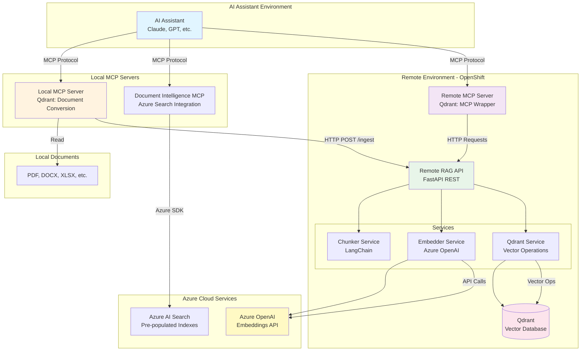

# Enterprise RAG System with MCP Integration

A production-ready Retrieval-Augmented Generation (RAG) system designed for enterprise document management and semantic search. The system provides **two complementary RAG solutions** optimized for AI assistant integration via the Model Context Protocol (MCP).

## Overview

This repository contains **three MCP servers** for different RAG use cases:

### 1. **Qdrant RAG System** (Phases 1-3: Complete)
A full-featured document ingestion and search pipeline with character-based chunking:
- **Local MCP Server** - Document conversion using markitdown
- **Remote RAG API** - FastAPI service with Qdrant vector storage
- **Remote MCP Server** - MCP wrapper for RAG API (Phase 4)

**Best for:** Simple text documents, high-volume ingestion, pure vector similarity search

### 2. **Document Intelligence MCP** (New: Standalone)
A lightweight read-only search interface for Azure AI Search indexes:
- **Single local MCP server** - Direct Azure AI Search integration
- **Hybrid search** - Combines keyword + vector similarity
- **Pre-indexed documents** - Searches existing Azure AI Search indexes

**Best for:** Complex structured documents, hybrid search, reading pre-populated indexes

---

## System Comparison

| Feature | Qdrant RAG | Document Intelligence MCP |
|---------|------------|---------------------------|
| **Architecture** | Local + Remote (3 components) | Standalone local (1 component) |
| **Document Ingestion** | ✅ Yes (via Remote API) | ❌ No (MVP - read only) |
| **Search Type** | Vector similarity only | Hybrid (keyword + vector) |
| **Chunking** | Character-based (512 chars) | Semantic (pre-chunked) |
| **Storage** | Qdrant vector database | Azure AI Search indexes |
| **Setup Complexity** | Higher (requires deployment) | Lower (just credentials) |
| **Use Case** | New document pipelines | Existing Azure Search indexes |

## Architecture

### High-Level Architecture - Complete System



### Component Architecture

The system consists of three main components:

#### 1. Local MCP Server
**Purpose**: Convert local binary documents to text

**Responsibilities**:
- Document format conversion (PDF, DOCX, XLSX, HTML, etc.)
- File metadata extraction (filename, size, extension)
- Optional forwarding to Remote RAG API for ingestion

**Technology**:
- Python 3.11+
- markitdown library (Microsoft)
- MCP protocol server
- httpx for async HTTP

**Location**: `local-mcp-server/`

#### 2. Remote RAG API
**Purpose**: HTTP REST API for document ingestion and semantic search

**Responsibilities**:
- Text chunking with configurable overlap
- Embedding generation via Azure OpenAI
- Vector storage and retrieval in Qdrant
- Collection management
- Document retrieval by ID

**Technology**:
- FastAPI with async operations
- LangChain RecursiveCharacterTextSplitter
- Azure OpenAI (text-embedding-3-small, 1536 dimensions)
- Qdrant async client
- Structured logging (structlog)
- API key authentication

**Location**: `remote-rag-server/`

**Endpoints**:
- `GET /health` - Health check
- `POST /ingest` - Ingest text content
- `POST /ingest_url` - Ingest from HTTPS URL
- `POST /search` - Semantic search
- `GET /collections` - List collections
- `GET /documents/{id}` - Get document by ID

#### 3. Remote MCP Server
**Purpose**: MCP protocol wrapper for Remote RAG API

**Responsibilities**:
- Expose RAG functionality via MCP protocol
- Enable direct AI assistant integration
- Translate MCP tool calls to HTTP API requests

**Status**: Phase 4 (Planned)

**Location**: `remote-rag-server/src/remote_rag/mcp/`

## End-to-End Process Flows

### Flow 1: Local Document Ingestion

Convert a local document and ingest it into the RAG system.


**Steps**:
1. AI assistant calls `convert_and_ingest` tool with local file path
2. Local MCP Server reads and converts file to text
3. Converted text sent to Remote RAG API
4. API chunks text into manageable pieces (512 chars with 50 overlap)
5. Chunks sent to Azure OpenAI for embedding generation
6. Embeddings and metadata stored in Qdrant vector database
7. Chunk IDs returned to AI assistant

### Flow 2: URL Document Ingestion

Ingest a document directly from an HTTPS URL.


**Steps**:
1. AI assistant calls `ingest_url` tool via Remote MCP Server
2. Remote RAG API fetches document from HTTPS URL
3. Document converted to text
4. Text chunked and embedded (same as Flow 1)
5. Stored in Qdrant with source URL in metadata
6. Confirmation returned to AI assistant

### Flow 3: Semantic Search

Search for relevant information using natural language queries.


**Steps**:
1. AI assistant searches with natural language query
2. Query converted to embedding vector
3. Qdrant performs vector similarity search
4. Results ranked by similarity score (0.0-1.0)
5. Relevant chunks with metadata returned
6. AI assistant uses retrieved context for response generation

## Data Flow

### Document Processing Pipeline


### Search Pipeline


## Technology Stack

### Local MCP Server
- **Python**: 3.11+
- **Document Conversion**: markitdown 0.1.3+
- **HTTP Client**: httpx 0.28+ (async)
- **MCP Protocol**: mcp 1.0+

### Remote RAG API
- **Python**: 3.11+
- **Web Framework**: FastAPI 0.119+ (async)
- **Text Chunking**: LangChain 1.0+ (RecursiveCharacterTextSplitter)
- **Embeddings**: Azure OpenAI API (openai 2.5+)
  - Model: text-embedding-3-small
  - Dimensions: 1536
- **Vector Database**: Qdrant 1.15+ (async client)
- **Document Conversion**: markitdown 0.1.3+
- **Logging**: structlog 24.0+
- **Validation**: pydantic 2.0+

### Infrastructure
- **Deployment**: OpenShift container platform
- **Vector Database**: Qdrant (cloud or self-hosted)
- **Embeddings API**: Azure OpenAI Service

## Project Structure

```
knowledge-mcp/
├── README.md                          # This file (overview)
├── .gitignore                         # Git ignore rules
│
├── local-mcp-server/                  # Qdrant: Local document conversion
│   ├── src/local_mcp/
│   │   ├── config.py              # Configuration
│   │   ├── converter.py           # DocumentConverter (markitdown)
│   │   ├── ingest_client.py       # IngestClient (HTTP to Remote API)
│   │   └── server.py              # MCP Server (2 tools)
│   ├── tests/                     # 55+ tests, 90%+ coverage
│   ├── pyproject.toml
│   ├── README.md
│   └── .env.example
│
├── remote-rag-server/                 # Qdrant: Remote RAG API
│   ├── src/remote_rag/
│   │   ├── config.py              # Configuration
│   │   ├── api/
│   │   │   ├── app.py             # FastAPI application (6 endpoints)
│   │   │   ├── auth.py            # API key authentication
│   │   │   ├── logging.py         # Structured logging
│   │   │   └── models.py          # Pydantic models
│   │   ├── services/
│   │   │   ├── chunker.py         # ChunkerService (LangChain)
│   │   │   ├── embedder.py        # EmbedderService (Azure OpenAI)
│   │   │   └── qdrant.py          # QdrantService (vector ops)
│   │   └── mcp/                   # (Phase 4: MCP Server)
│   │       └── server.py          # MCP protocol wrapper
│   ├── tests/                     # 83 tests, 89% coverage
│   ├── pyproject.toml
│   ├── README.md
│   ├── API_DOCUMENTATION.md       # Complete API reference
│   └── .env.example
│
├── docint-mcp-server/                 # NEW: Document Intelligence MCP
│   ├── src/docint_mcp/
│   │   ├── config.py              # Configuration
│   │   ├── models.py              # Data models
│   │   ├── azure_search_client.py # Azure AI Search wrapper
│   │   └── server.py              # MCP Server (3 tools)
│   ├── tests/                     # 17+ tests, 89% coverage
│   │   ├── conftest.py
│   │   ├── test_azure_search_client.py
│   │   └── test_server.py
│   ├── pyproject.toml
│   ├── README.md
│   └── .env.example
│
├── docs/                              # Specifications and guides
│   └── AZURE_DOC_INTELLIGENCE_SPEC.md # Document Intelligence spec
│
└── .vibe/                             # Development planning
    ├── development-plan-default.md    # Project plan and progress
    └── docs/
        ├── architecture.md            # Architecture decisions
        └── design.md                  # Design specifications
```

## Quick Start

### Prerequisites

**For Qdrant RAG System:**
- Python 3.11 or higher
- Azure OpenAI API access (for embeddings)
- Qdrant instance (local or cloud)
- OpenShift cluster (for production deployment)

**For Document Intelligence MCP:**
- Python 3.11 or higher
- Azure AI Search service with pre-populated indexes
- Azure AI Search API key (admin or query key)

### Option 1: Setup Document Intelligence MCP (Fastest!)

For quick read-only access to existing Azure AI Search indexes:

```bash
cd docint-mcp-server

# Install dependencies
uv venv
source .venv/bin/activate  # On Windows: .venv\Scripts\activate
uv pip install -e ".[dev]"

# Configure
cp .env.example .env
# Edit .env with your Azure AI Search endpoint and key

# Run tests
uv run pytest -v

# Test coverage
uv run pytest --cov=docint_mcp --cov-report=term-missing
```

**Usage with Claude Desktop:**

Add to `~/Library/Application Support/Claude/claude_desktop_config.json`:

```json
{
  "mcpServers": {
    "docint": {
      "command": "/path/to/docint-mcp-server/.venv/bin/python",
      "args": ["-m", "docint_mcp.server"],
      "env": {
        "AZURE_SEARCH_ENDPOINT": "https://your-search.search.windows.net",
        "AZURE_SEARCH_KEY": "your-key"
      }
    }
  }
}
```

**Available Tools:**
- `search_documents` - Search indexes with hybrid search
- `list_indexes` - List available indexes
- `get_document` - Retrieve document by ID

---

### Option 2: Setup Qdrant RAG System (Full Pipeline)

For complete document ingestion and search pipeline:

#### 2.1. Setup Local MCP Server

```bash
cd local-mcp-server

# Install dependencies
uv venv
source .venv/bin/activate  # On Windows: .venv\Scripts\activate
uv pip install -e ".[dev]"

# Configure
cp .env.example .env
# Edit .env with your Remote RAG API URL

# Run tests
uv run pytest -v
```

#### 2.2. Setup Remote RAG API

```bash
cd remote-rag-server

# Install dependencies
uv venv
source .venv/bin/activate
uv pip install -e ".[dev]"

# Configure
cp .env.example .env
# Edit .env with Azure OpenAI and Qdrant credentials

# Run tests
uv run pytest -v

# Start server
uvicorn remote_rag.api.app:app --reload --host 0.0.0.0 --port 8000
```

#### 2.3. Test the Qdrant System

```bash
# Test health endpoint
curl http://localhost:8000/health

# Ingest text (requires API key)
curl -X POST http://localhost:8000/ingest \
  -H "X-API-Key: your-api-key" \
  -H "Content-Type: application/json" \
  -d '{
    "text": "Machine learning is a subset of artificial intelligence...",
    "collection_name": "test",
    "metadata": {"source": "test"}
  }'

# Search
curl -X POST http://localhost:8000/search \
  -H "X-API-Key: your-api-key" \
  -H "Content-Type: application/json" \
  -d '{
    "query": "What is machine learning?",
    "collection_name": "test",
    "limit": 5
  }'
```

## Configuration

### Document Intelligence MCP Configuration

Key settings in `docint-mcp-server/.env`:
```bash
# Azure AI Search (required)
AZURE_SEARCH_ENDPOINT=https://your-search-service.search.windows.net
AZURE_SEARCH_KEY=your-admin-or-query-key

# Optional defaults
DEFAULT_INDEX_NAME=default
DEFAULT_TOP_RESULTS=5
MAX_TOP_RESULTS=50
```

### Qdrant Local MCP Server Configuration

Key settings in `local-mcp-server/.env`:
```bash
# Remote RAG API connection
REMOTE_RAG_API_URL=http://localhost:8000
REMOTE_RAG_API_KEY=your-api-key
```

### Qdrant Remote RAG API Configuration

Key settings in `remote-rag-server/.env`:
```bash
# Azure OpenAI (required)
AZURE_OPENAI_API_KEY=your-azure-key
AZURE_OPENAI_ENDPOINT=https://your-instance.openai.azure.com
AZURE_OPENAI_EMBEDDING_DEPLOYMENT=text-embedding-3-small

# Qdrant (required)
QDRANT_URL=http://localhost:6333
QDRANT_API_KEY=your-qdrant-key

# API Security
API_KEY=your-secure-api-key

# Chunking (optional, defaults shown)
CHUNK_SIZE=512
CHUNK_OVERLAP=50
```

See individual component README files for complete configuration options.

## Deployment

### Development

Both components run locally for development:

```bash
# Terminal 1 - Remote RAG API
cd remote-rag-server
uvicorn remote_rag.api.app:app --reload

# Terminal 2 - Local MCP Server
cd local-mcp-server
python -m local_mcp.server
```

### Production (OpenShift)

The Remote RAG API is deployed as a containerized application on OpenShift:

1. **Build container image**
2. **Deploy to OpenShift with**:
   - ConfigMap for non-sensitive configuration
   - Secret for API keys and credentials
   - Service for internal communication
   - Route for external access (HTTPS)

The Local MCP Server runs on user workstations and connects to the deployed API.

See deployment documentation (Phase 5) for detailed instructions.

## Testing

### Test Coverage Summary

| Component | Tests | Coverage | Description |
|-----------|-------|----------|-------------|
| **Document Intelligence MCP** | 17+ | 89% | Azure Search client, MCP tools |
| **Local MCP Server (Qdrant)** | 55+ | 90%+ | Document conversion, HTTP client |
| **Remote RAG API (Qdrant)** | 83 | 89% | Services, endpoints, authentication |

### Running Tests

```bash
# Document Intelligence MCP
cd docint-mcp-server
uv run pytest --cov=docint_mcp --cov-report=term-missing

# Local MCP Server (Qdrant)
cd local-mcp-server
uv run pytest --cov=local_mcp --cov-report=term-missing

# Remote RAG API (Qdrant)
cd remote-rag-server
uv run pytest --cov=remote_rag --cov-report=term-missing

# Code quality (any component)
uv run ruff check src/
uv run mypy src/
```

## Performance Considerations

### Chunking Strategy
- **Chunk size**: 512 characters (configurable)
- **Overlap**: 50 characters (maintains context)
- **Trade-off**: Smaller chunks = more precise search but more embeddings

### Embedding Generation
- **Model**: text-embedding-3-small (1536 dimensions)
- **Batch processing**: Multiple chunks embedded in single API call
- **Rate limits**: Respect Azure OpenAI rate limits

### Vector Search
- **Distance metric**: Cosine similarity
- **Search speed**: O(log n) with Qdrant HNSW index
- **Filtering**: Metadata filters applied before vector search

### Scaling Recommendations
- **API workers**: 4-8 workers for production (uvicorn --workers)
- **Connection pooling**: Async clients reuse connections
- **Qdrant clustering**: For high availability
- **Caching**: Consider caching frequent queries

## Security

### Authentication
- **API Key**: HTTP header-based authentication
- **MCP Protocol**: Runs locally, no network authentication needed
- **Azure OpenAI**: API key authentication
- **Qdrant**: API key authentication

### Best Practices
- Store credentials in environment variables or secure vault
- Use HTTPS in production (configure reverse proxy)
- Rotate API keys regularly
- Restrict API access to known IP ranges
- Monitor API usage for anomalies

### Data Privacy
- Documents processed locally before cloud upload
- Configure retention policies in Qdrant
- Implement data deletion workflows as needed
- Consider data residency requirements for cloud services

## Troubleshooting

### Common Issues

**Issue**: Cannot connect to Remote RAG API
- Verify API is running: `curl http://localhost:8000/health`
- Check network connectivity
- Verify API URL in configuration

**Issue**: Embedding generation fails
- Verify Azure OpenAI credentials
- Check API quota and rate limits
- Ensure deployment name matches configuration

**Issue**: Search returns no results
- Confirm documents have been ingested
- Check collection name matches
- Verify Qdrant connection
- Review score threshold setting

**Issue**: Document conversion fails
- Ensure markitdown supports file format
- Check file is not corrupted
- Verify file permissions

See component-specific README files for detailed troubleshooting.

## Development Status

### Completed

**Qdrant RAG System:**
- ✅ **Phase 1**: Local MCP Server - Document conversion and ingestion
- ✅ **Phase 2**: Remote RAG API - Core services (chunking, embedding, vector storage)
- ✅ **Phase 3**: Remote RAG API - HTTP endpoints, authentication, comprehensive testing

**Document Intelligence MCP:**
- ✅ **Phase 1**: Azure Search client implementation (17+ tests, 89% coverage)
- 🚧 **Phase 2**: MCP server with 3 tools (in progress)
- ⏳ **Phase 3**: Documentation and manual testing

### In Progress
- **Qdrant Phase 4**: Remote MCP Server - MCP protocol wrapper for RAG API
- **DocInt Phase 2**: MCP server implementation

### Planned
- **Qdrant Phase 5**: OpenShift deployment - Container, manifests, deployment scripts
- **Qdrant Phase 6**: Integration testing - End-to-end testing, performance testing
- **DocInt Phase 4** (Future): Document ingestion with Azure Document Intelligence analysis

## Documentation

### Main Documentation
- **README.md** (this file): Complete system overview and quick start
- **docs/AZURE_DOC_INTELLIGENCE_SPEC.md**: Document Intelligence MCP specification

### Component Documentation

**Document Intelligence MCP:**
- **docint-mcp-server/README.md**: Setup, configuration, and usage guide

**Qdrant RAG System:**
- **local-mcp-server/README.md**: Local MCP Server documentation
- **local-mcp-server/TESTING.md**: Testing guide for Local MCP
- **remote-rag-server/README.md**: Remote RAG API documentation
- **remote-rag-server/API_DOCUMENTATION.md**: Complete API reference with examples

### Architecture and Design
- **.vibe/docs/architecture.md**: Architecture decisions and rationale
- **.vibe/docs/design.md**: Design specifications and conventions
- **.vibe/development-plan-default.md**: Project plan and progress

## Contributing

1. Follow existing code style and conventions
2. Add tests for new features (maintain 80%+ coverage)
3. Update documentation for changes
4. Run linter and type checker before committing
5. Use descriptive commit messages

## License

[Specify your license here]

## Support

For issues, questions, or contributions:
- Review documentation in component directories
- Check troubleshooting sections
- Examine logs for detailed error information
- Create issues in the project repository

## Acknowledgments

- **markitdown**: Microsoft's document conversion library
- **LangChain**: Text splitting and chunking utilities
- **Qdrant**: High-performance vector database
- **FastAPI**: Modern Python web framework
- **Azure OpenAI**: Embedding generation service
